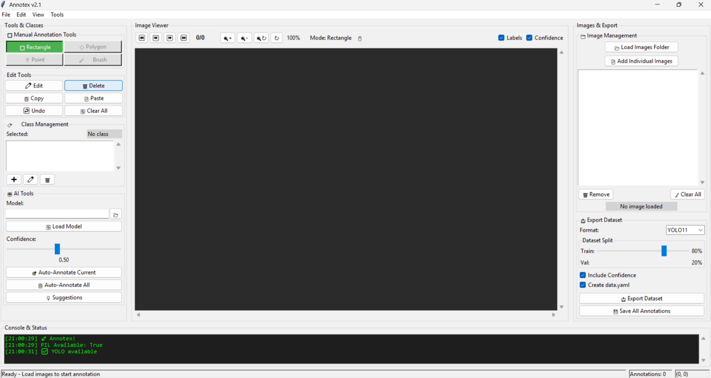

# Annotex 🚀

**AI-Powered Annotation Tool for Computer Vision Datasets**

[](https://www.python.org/downloads/)
[](https://opensource.org/licenses/MIT)
[](https://badge.fury.io/py/annotex)
[](https://pepy.tech/project/annotex)

Annotex is a professional-grade annotation tool designed for creating high-quality computer vision datasets. With AI-powered assistance and an intuitive interface, it streamlines the annotation process for machine learning practitioners.



## ✨ Features

### 🎯 **Professional Annotation Tools**
- **Rectangle Annotation** - Precise bounding box creation
- **AI-Assisted Annotation** - Auto-annotation with YOLO models
- **Batch Processing** - Process multiple images simultaneously
- **Smart Suggestions** - AI-powered annotation recommendations

### 🔧 **Advanced Workflow**
- **Project Management** - Save/load projects (.anno format)
- **Class Management** - Dynamic class creation with custom colors
- **Export Formats** - YOLO11, YOLOv8, YOLOv5 compatible
- **Quality Control** - Confidence scoring and validation

### 🚀 **Performance Optimized**
- **GPU Acceleration** - CUDA support for AI features
- **Memory Efficient** - Handles large datasets smoothly
- **Real-time Preview** - Instant annotation feedback
- **Keyboard Shortcuts** - Professional workflow acceleration

## 📦 Installation

### Quick Install
```bash
pip install annotex
```

### With GPU Support
```bash
pip install annotex[gpu]
```

### Development Install
```bash
git clone https://github.com/yourusername/annotex.git
cd annotex
pip install -e .[dev]
```

## 🚀 Quick Start

### Launch Annotex
```bash
# Start the GUI
annotex

# Load a project
annotex --project my_project.anno

# Load images from directory
annotex --images /path/to/images
```

### Basic Workflow
1. **Load Images** - Import your image dataset
2. **Create Classes** - Define annotation classes
3. **Annotate** - Create bounding boxes manually or with AI
4. **Export** - Generate YOLO-format dataset


## 📚 Documentation

### Basic Usage

```python
# Command line usage
annotex --images ./my_images --project my_annotations.anno

# Python API (coming soon)
from annotex import AnnotationProject

project = AnnotationProject("my_project.anno")
project.load_images("./images/")
project.auto_annotate(model="yolo11n.pt")
project.export("./dataset/", format="YOLO11")
```

### Keyboard Shortcuts
| Shortcut | Action |
|----------|--------|
| `Ctrl+N` | New Project |
| `Ctrl+O` | Load Project |
| `Ctrl+S` | Save Current |
| `Ctrl+E` | Export Dataset |
| `R` | Rectangle Tool |
| `Delete` | Delete Selected |
| `Ctrl+Z` | Undo |

## 🎨 Interface Overview

### Main Components
- **Tools Panel** - Annotation tools and class management
- **Image Viewer** - Zoomable canvas with annotation overlay
- **Image List** - Project image management
- **Export Panel** - Dataset export configuration

### Advanced Features
- **Semi-Automated Annotation** - AI model integration
- **Batch Processing** - Multi-image operations
- **Quality Metrics** - Annotation statistics and validation
- **Custom Export** - Flexible dataset formats

## 🤖 AI Integration

### Supported Models
- **YOLO11** - Latest YOLO architecture
- **YOLOv8** - Efficient object detection
- **YOLOv5** - Proven performance
- **Custom Models** - Load your own trained models

### Auto-Annotation Workflow
```bash
1. Load pre-trained model
2. Set confidence threshold
3. Run batch annotation
4. Review and refine results
5. Export final dataset
```

## 📁 Project Structure

```
my_project/
├── images/           # Original images
├── annotations/      # Generated .txt files (YOLO format)
├── project.anno      # Project configuration
└── exported/         # Final dataset
    ├── train/
    ├── val/
    └── data.yaml
```

## 🔧 Configuration

### Model Configuration
```yaml
# config.yaml
model:
  path: "yolo11n.pt"
  confidence: 0.5
  device: "cuda"  # or "cpu"

export:
  format: "YOLO11"
  split_ratio: 0.8
  include_confidence: true
```

## 🤝 Contributing

We welcome contributions! Please see [CONTRIBUTING.md](CONTRIBUTING.md) for guidelines.

### Development Setup
```bash
git clone https://github.com/yourusername/annotex.git
cd annotex
pip install -e .[dev]
pre-commit install
```

### Running Tests
```bash
pytest tests/
```

## 📄 License

This project is licensed under the MIT License - see the [LICENSE](LICENSE) file for details.

## 🏗️ Roadmap

### Version 1.1 (Coming Soon)
- [ ] Polygon annotation tool
- [ ] Point annotation support
- [ ] Brush/segmentation tool
- [ ] COCO format export
- [ ] Pascal VOC format support

### Version 1.2 (Planned)
- [ ] Cloud storage integration
- [ ] Team collaboration features
- [ ] Advanced AI suggestions
- [ ] Mobile app companion

## 📞 Support

- 📖 **Documentation**: [GitHub Wiki](https://github.com/yourusername/annotex/wiki)
- 🐛 **Bug Reports**: [GitHub Issues](https://github.com/yourusername/annotex/issues)
- 💬 **Discussions**: [GitHub Discussions](https://github.com/yourusername/annotex/discussions)
- 📧 **Email**: your.email@example.com

## 🌟 Acknowledgments

- [Ultralytics](https://ultralytics.com/) for YOLO implementation
- [OpenCV](https://opencv.org/) for computer vision tools
- [Tkinter](https://docs.python.org/3/library/tkinter.html) for GUI framework

---

**⭐ Star us on GitHub if Annotex helps your projects!**

Made with ❤️ by [Your Name](https://github.com/yourusername)